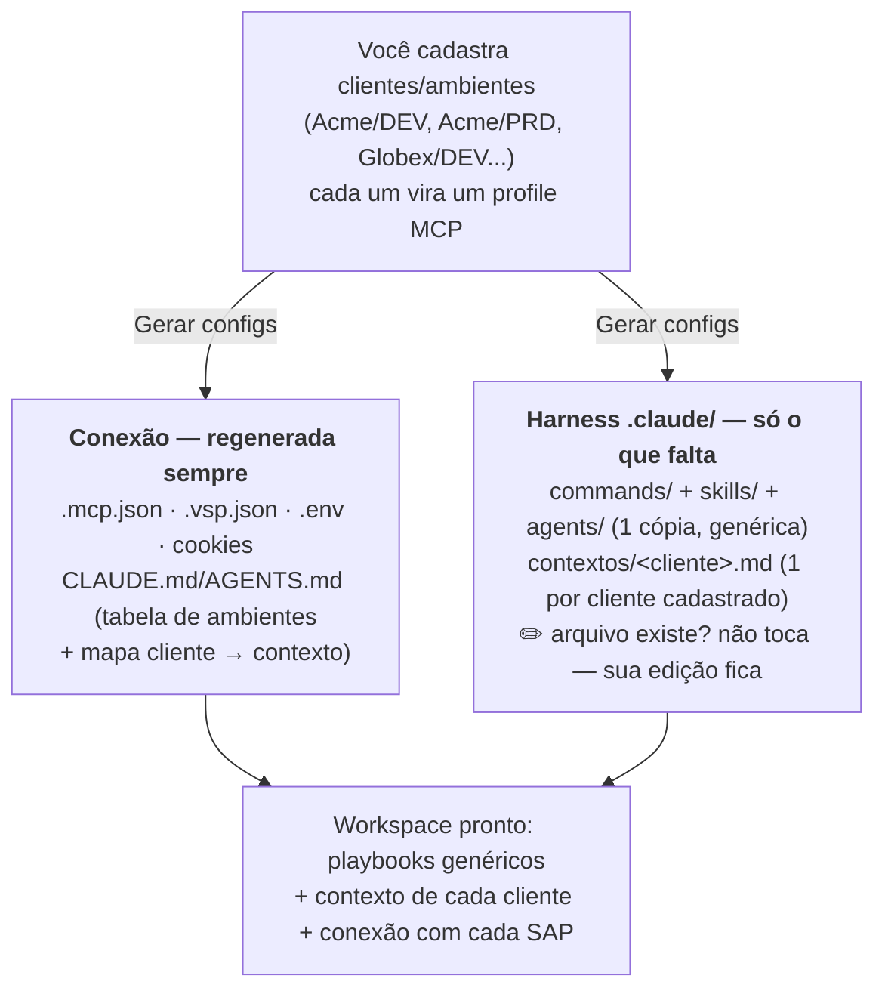
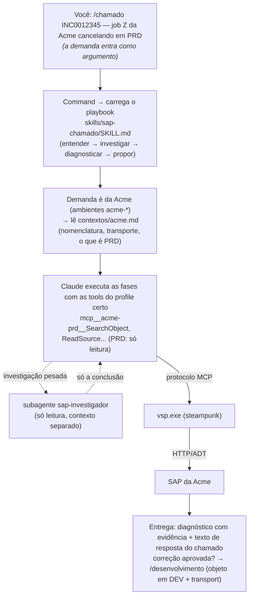

# SAP MCP Cockpit

App desktop (Electron) que **liga seu assistente de IA (Claude Code / Codex) ao SAP via MCP** — sem editar `.mcp.json` / `.vsp.json` / config do Codex na mão.

Você cadastra **clientes e ambientes** (Cloud SSO ou On-Premise basic auth) e o app gera toda a configuração, faz o login SSO, testa a conexão e abre o projeto no VSCode. Hoje o **motor** é o [`vsp`](https://github.com/oisee/vibing-steampunk) (vibing-steampunk); a ideia é suportar outros motores (ex.: ARC-1) no futuro.

Cada ambiente vira um MCP server nomeado `cliente-ambiente` (ex.: `mcp__acme-dev__*`).

> 📖 **Primeira vez?** Siga o **[TUTORIAL.md](TUTORIAL.md)** — passo a passo do zero (baixar o app + o vsp, montar as pastas, cadastrar ambiente, gerar config e abrir no VSCode já conversando com o SAP).

---

## Pré-requisitos

- **Node.js** (vem com `npm`)
- **`vsp.exe`** baixado (https://github.com/oisee/vibing-steampunk/releases)
- **VSCode** com `code` no PATH (pra abrir pelo botão / usar Claude Code)
- **Chrome** (pro browser-auth dos tenants Cloud — o Edge tem bug com o vsp)
- **Codex** instalado (só se for usar Codex — o app mescla a config no `~/.codex/config.toml`)

## Instalar e rodar

```powershell
npm install
npm start
```

## Como usar

1. **Configurações** (topo): caminho do `vsp.exe`, pasta do projeto (workspace), caminho do Chrome, comando do VSCode (`code`). Clique **Salvar configurações**.
2. **+ Novo ambiente**: Cliente + Ambiente (ex.: `Acme` / `DEV` → profile `acme-dev`), tipo **Cloud** (SSO) ou **On-Premise** (user + senha), URL + Client SAP, e flags (mode, `--insecure`, edits transportáveis, transports).
   - Use **expert** se for **criar/editar objeto** (precisa das tools `LockObject`/`UpdateSource`).
3. **Login SSO** (só Cloud): no card do ambiente → **Login SSO** → conclua no Chrome → cookie salvo (`cookies-<profile>.txt`).
4. **Testar**: pinga o ambiente (busca ADT leve) e diz se conexão + auth + ADT estão OK.
5. **Gerar configs**: escreve a config (ver tabela abaixo).
6. **Abrir no VSCode**: abre a pasta do projeto pro Claude Code.

## Arquivos / config gerados

| Onde | Pra quem | Conteúdo |
|---|---|---|
| `.vsp.json` (projeto) | comum | Profiles (URL, client, `cookie_file` p/ cloud, `user`/`insecure` p/ onprem) |
| `.env` (projeto) | comum | Senhas on-prem (`VSP_<PROFILE>_PASSWORD`, com e sem hífen) |
| `cookies-<profile>.txt` (projeto) | comum | Cookie SSO de cada tenant cloud |
| `.mcp.json` (projeto) | **Claude Code** | Um MCP server por ambiente, **conexão explícita** nos args |
| `CLAUDE.md` / `AGENTS.md` (projeto) | **Claude / Codex** | Instruções do workspace + playbook de operação |
| `~/.codex/config.toml` (global) | **Codex** | Bloco gerenciado `[mcp_servers.<profile>]` (só se o Codex existir na máquina) |
| `.gitignore` (projeto) | — | Ignora `.env`, `.vsp.json`, `.mcp.json`, `.codex/`, `cookies*.txt` |
| `.claude/` (projeto) | **Claude Code** (Codex lê via instrução) | **Harness**: playbooks por tipo de demanda (chamado / desenvolvimento / projeto), subagentes e contexto do cliente — ver seção abaixo |

> **Codex lê MCP do `~/.codex/config.toml` GLOBAL**, não de um arquivo no projeto. O app mescla um bloco gerenciado (delimitado por marcadores) preservando o resto da sua config. As tools MCP só aparecem ao **reiniciar o Codex** (sessão nova).

## Harness de trabalho (`.claude/`)

Além da conexão, o **Gerar configs** monta um **harness** no workspace — fluxos de trabalho prontos que o Claude Code carrega sozinho (inspirado no guia [Everything Claude Code](https://github.com/affaan-m/ECC/blob/main/the-longform-guide.md)):

```
.claude/
├── contextos/
│   ├── acme.md                ← regras do cliente Acme (nomenclatura, transporte…) — PREENCHA
│   └── globex.md              ← um arquivo por cliente cadastrado, criado sozinho
├── commands/                  ← /chamado, /desenvolvimento, /projeto
├── skills/
│   ├── sap-chamado/           ← playbook de chamado de suporte (diagnóstico + resposta)
│   ├── sap-desenvolvimento/   ← playbook de solicitação de desenvolvimento (spec → transport)
│   └── sap-projeto/           ← playbook de projeto multi-sessão (PLANO/PROGRESSO/DECISOES)
└── agents/
    ├── sap-investigador.md    ← subagente só-leitura (varredura de código sem poluir contexto)
    └── sap-desenvolvedor.md   ← subagente que grava objeto pelo fluxo de edição segura
```

Uso no Claude Code: `/chamado INC0012345 job Z... cancelando`, `/desenvolvimento <spec>`, `/projeto rollout-fiori`. No Codex não há slash commands, mas o `AGENTS.md` instrui a ler o playbook correspondente.

Pensado pro **consultor multi-cliente numa máquina só**: os playbooks são genéricos (1 cópia, seu jeito de trabalhar); o que varia por cliente fica em `contextos/<cliente>.md` — o agente identifica o cliente pelo profile do ambiente (`acme-*` → `contextos/acme.md`) e o `CLAUDE.md` gerado traz esse mapa. Cadastrou cliente novo no Cockpit? O contexto dele nasce vazio no próximo "Gerar configs", pronto pra preencher.

### Como as camadas conversam

O harness (`.claude/`) diz ao agente **o que fazer e em que ordem**; o vsp expõe via MCP **as ferramentas** pra fazer. Eles nunca se falam diretamente — quem junta os dois é o Claude Code em tempo de execução.

**Fase A — preparar (no Cockpit, 1× por cliente):**



**Fase B — atender uma demanda (no Claude Code, todo dia):**



| Nível | Onde vive | Muda quando |
|---|---|---|
| **Base** | `harness/` (este repo) | O produto evolui — melhoria vale pra todos |
| **Cliente** | `.claude/contextos/<cliente>.md` | 1× por cliente novo (nasce sozinho, você preenche) |
| **Demanda** | Argumento do comando + `projetos/<nome>/` | A cada chamado/spec/projeto |

**Customização é o ponto:** o Cockpit escreve esses arquivos **só se não existirem** — edite qualquer um (regras por tipo de chamado, template de resposta, novos comandos como `/auditoria`) e o "Gerar configs" nunca sobrescreve. Apagou um arquivo? O próximo "Gerar configs" restaura o padrão. Os templates ficam em [harness/](harness/) neste repositório.

## Por que a conexão vai explícita nos args

Em modo MCP, o `vsp` **não aplica o `-s <profile>`** — ele exige `--url`/`--client`/`--cookie-file` (cloud) ou `--user`/`--password`/`--insecure` (on-prem) direto. Por isso o app gera os servers com a conexão completa nos `args` (self-contained), em vez de depender do `.vsp.json` + cwd. Pros ambientes Codex, também adiciona `startup_timeout_sec`/`tool_timeout_sec` generosos.

## Onde ficam os dados do app

`settings.json` e `clients.json` em `%APPDATA%/sap-mcp-cockpit/` (perfil do usuário). As senhas on-prem ficam aí e no `.env`/config gerados (texto plano, protegido pela ACL do seu usuário). *(Migração automática do nome antigo `steampunk-manager` é feita no primeiro start.)*

## Fluxo de desenvolvimento → build → release (pra quem mexe no código)

Roteiro completo de **depois que você alterou o código** até publicar uma nova versão. Tudo em **PowerShell**, na raiz do projeto.

> Confirme antes que o `gh` está na conta certa: `gh auth status`. Se não estiver: `gh auth switch --user sydrack033`.

### 1. Testar a mudança no app
```powershell
npm start
```
> Mexeu só no `renderer/` (HTML/CSS/JS da tela)? Dá pra recarregar a janela aberta com **Ctrl+R** em vez de reiniciar. Mexeu no `main.js`/`preload.js`? Tem que fechar e `npm start` de novo.

### 2. Subir o fonte numa branch nova
```powershell
# cria e já entra na branch nova (troque o nome)
git checkout -b feature/minha-mudanca

# commita tudo
git add -A
git commit -m "descreva a mudança aqui"

# sobe a branch e cria o tracking
git push -u origin feature/minha-mudanca
```
Depois, **abra o Pull Request** no GitHub e faça o merge na `main`. (Ou, se for direto, sem PR:)
```powershell
git checkout main
git merge feature/minha-mudanca
git push
```

### 3. Subir versão (gera commit + tag automático)
Na `main`, já com tudo mergeado:
```powershell
git checkout main
git pull

# escolha um: patch (1.0.0->1.0.1) | minor (1.0.0->1.1.0) | major (1.0.0->2.0.0)
npm version minor

# sobe o commit de versão + a tag (ex.: v1.1.0)
git push --follow-tags
```
> `npm version` atualiza o `package.json` e **cria a tag `vX.Y.Z`** sozinho.

### 4. Gerar o `.exe` portátil (já com a versão nova)
```powershell
npm run dist
```
Gera `..\..\sap-mcp-cockpit-dist\SAPMCPCockpit-<versão>-portable.exe` (roda com duplo-clique, sem Node). A saída fica **fora** da pasta do projeto de propósito (evita o VSCode travar o `.exe` durante o build).
> Feche qualquer portátil do Cockpit aberto antes do build, senão dá erro de arquivo travado.

### 5. Publicar a Release no GitHub (com o `.exe` anexado)
Troque a versão nos dois lugares (`v1.1.0` e o nome do arquivo):
```powershell
gh release create v1.1.0 --repo sydrack033/sap-mcp-cockpit --title "SAP MCP Cockpit v1.1.0" --notes "O que mudou nesta versão." "..\..\sap-mcp-cockpit-dist\SAPMCPCockpit-1.1.0-portable.exe"
```
Conferir:
```powershell
gh release view v1.1.0 --repo sydrack033/sap-mcp-cockpit
```
> Link fixo de download da última versão (pra divulgar): `https://github.com/sydrack033/sap-mcp-cockpit/releases/latest`

### Resumo (cola rápida)
```powershell
git checkout -b feature/x; git add -A; git commit -m "..."; git push -u origin feature/x
# (merge na main pelo PR, depois:)
git checkout main; git pull; npm version minor; git push --follow-tags
npm run dist
gh release create v1.1.0 --repo sydrack033/sap-mcp-cockpit --title "SAP MCP Cockpit v1.1.0" --notes "..." "..\..\sap-mcp-cockpit-dist\SAPMCPCockpit-1.1.0-portable.exe"
```

> **Erro de symlink no `winCodeSign` durante o `npm run dist`?** O electron-builder baixa um pacote com symlinks de macOS que o Windows recusa sem Developer Mode/admin. Contorno: extrair o pacote no cache **sem a pasta `darwin`**:
> ```powershell
> $cache = "$env:LOCALAPPDATA\electron-builder\Cache\winCodeSign"
> $7za = ".\node_modules\7zip-bin\win\x64\7za.exe"
> & $7za x (Join-Path $cache (Get-ChildItem $cache -Filter *.7z)[0].Name) "-o$cache\winCodeSign-2.6.0" "-xr!darwin" -y
> ```

## Notas

- Cookies de tenant Cloud expiram → clique **Login SSO** de novo e reinicie o MCP (no VSCode: recarregar; no Codex: nova sessão).
- On-Premise quase sempre tem cert self-signed → deixe `--insecure` ligado.
- `403 Service cannot be reached` no ADT = serviço ADT não ativo na SICF (lado SAP), não é conexão.
- Em **SAP ECC antigo**, o `vsp` pode falhar a gravação de objeto (`423 lock handle invalid`) por limitação de sessão stateful do ADT — é do motor, não do app.
